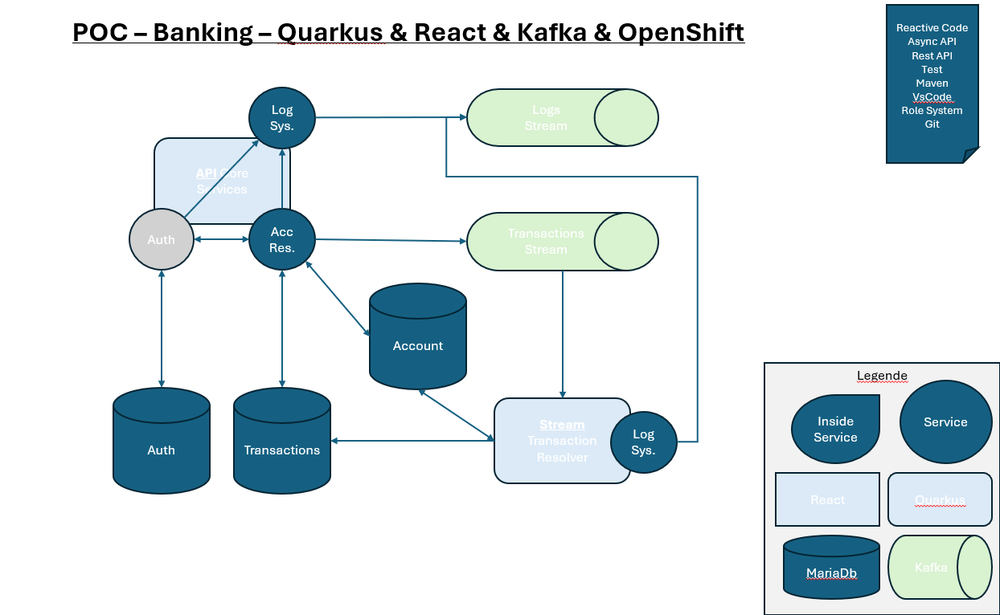

# Project Name ReadMe

## Prerequisites

To run this project, you need the following dependencies installed on your machine:

- GraalVM
- JDK Java 17
- Maven
- Docker

## Project Architecture

**Project Description:**

This Quarkus project utilizes Mutiny, Kafka, and MariaDB to create a proof-of-concept (PoC) banking system. Key features include:

- **Authentication System:** Every user has authentication and registration system.
- **User Account :** For each authentification, we create an Account for the user.
- **User Account Metadata:** Users can modify the metadata of their bank accounts.
- **Banking Transactions:** The project allows users to create accounts and perform transactions with other registered users. All transactions are stored in a MariaDB database and presented in a Kafka stream. Each transaction is resolve by the resolve App.
- **Application Components:**
  - **Core App (app-core):** Represents the core of the application, including Swagger documentation, authentication, role management, and APIs.
  - **Resolver App (app-resolver):** Manages, executes and verifies transactions within the Kafka stream.

**Additional Information:**

- The Swagger documentation is exposed by the core app on port 8080, providing detailed descriptions of the available endpoints.

## Build Instructions

### Build Project Core

`./mvnw clean package -Pnative --define quarkus.native.container-build=true`

### Build Project Resolver

`./mvnw clean package -Pnative --define quarkus.native.container-build=true`

## Running the Project

After building the core and resolver projects, go to the root directory and launch the following command:

`docker-compose up`

This command will start the necessary Docker containers and deploy the project. Ensure that Docker is running and properly configured on your machine.

For additional configuration or customization, refer to the project documentation.

## Postman Collection

A Postman collection is available in the **others** directory for testing the project's API endpoints.

## Notes

- Make sure that no other services are using the required ports before running the `docker-compose up` command.
- Ensure GraalVM, JDK Java 17, and Maven are installed and properly configured on your machine.
- Check the project documentation for any additional setup or configuration steps.
- For troubleshooting or issues, please refer to the project's issue tracker on GitHub.
